# 雪茄俱乐部后端开发设计方案 v2.0（修订版）

> **项目**：CigarPro（GOAT CIGAR CLUB 山羊雪茄俱乐部）
> **范围**：微信小程序用户端 + React 管理后台 共用后端
> **基于**：`Cigar/微信小程序用户端前端说明文档_后端参考.md`、`Cigar_admin/CigarPro管理后台前端说明文档_供后端参考.md`、`微信小程序雪茄俱乐部2.0需求文档_融合会员等级版.md`
> **目标读者**：后端开发负责人、后端工程师（含新手）、QA、运维
> **文档目的**：可直接落地的后端开发依据
> **版本**：v2.0 / 2026-04-30（吸收一轮设计评审反馈，修复 7 项 P0 阻塞）

---

## 0. 文档地图（必读）

本设计方案是后端开发的总纲，落地实施请配合 `docs/backend/` 下的实战手册：

| 文件 | 用途 | 读者 |
|---|---|---|
| **Plan.md（本文件）** | 总体方案、范围、时间表、架构 | 全体 |
| `docs/backend/00_新人开发上手指南.md` | 第 1 天到第 1 周：从 0 跑通环境到提交第一个 PR | 新手必读 |
| `docs/backend/01_项目结构与编码规范.md` | NestJS 目录划分、命名/事务/锁/幂等/日志的编码模板 | 全体 |
| `docs/backend/02_数据库完整DDL.sql` | 可直接执行的建表脚本（含全部修订与 SEED） | 后端、DBA |
| `docs/backend/02_数据库设计补充.md` | 索引策略、约束推理、视图/触发器、归档策略 | 后端、DBA |
| `docs/backend/03_关键场景实现指南.md` | 幂等、事务、行级锁、库存预占、回调处理 6 大场景代码模板 | 后端 |
| `docs/backend/04_支付与对账详细设计.md` | 微信支付 v3 验签、美团对接、退款决策、对账与补单 | 后端、运维 |
| `docs/backend/05_测试用例清单.md` | 单元/集成/并发/支付沙箱测试用例 | QA、后端 |
| `docs/backend/06_部署与运维Runbook.md` | 三环境部署、灰度、监控、备份恢复、故障应急 | 运维、SRE |

> 新手开发者请按 `00 → 01 → 02 → 03` 的顺序阅读后再回到本文件查看接口/Sprint 计划。

---

## 0. 总览与技术栈选型

### 0.1 业务核心

- 实体店（线下雪茄俱乐部）+ 线上下单 + 美团收银
- 会员双等级体系（充值等级 V1–V9 + 消费等级 V1–V9，独立计算独立显示）
- 储值余额支付为主、美团收银为辅；充值通过微信支付 v3
- AI 推荐 + 风味海报 + 评价生态

### 0.2 推荐技术栈

| 层级 | 选型 | 理由 |
|---|---|---|
| 语言 / 框架 | **Node.js 20 LTS + NestJS 10 + TypeScript 5** | 与前端同栈、类型安全、模块化 |
| ORM | **Prisma 5** | Schema 即文档、迁移自动化、类型生成 |
| 数据库 | **PostgreSQL 15** | JSONB、行级锁、btree_gist（区间不重叠约束）、部分唯一索引 |
| 缓存 | **Redis 7** | Session/JWT 黑名单、登录失败计数、库存预占辅助、幂等键、限流 |
| 队列 | **BullMQ（基于 Redis）** | 等级重算、对账、推送、美团重试 |
| 对象存储 | **腾讯云 COS** | LOGO、海报底图、录音、Excel |
| 鉴权 | **JWT 双 Token + Redis 黑名单** | accessToken 30min（用户）/ 2h（管理员）+ refreshToken 7d |
| 加密 | **bcrypt（密码） + AES-256-GCM（PII/敏感配置）** | KMS 托管根密钥 |
| API 文档 | **NestJS Swagger 模块** | 自动生成 OpenAPI 3.0 |
| 部署 | **Docker + 微信云托管 / K8s + Nginx** | 微信支付域名校验、HTTPS |

> **备选方案**：若团队为 Java 背景，等价可换为 Spring Boot 3 + MyBatis-Plus + PostgreSQL。表结构与接口契约保持不变。

### 0.3 全局原则（七条铁律）

1. **金额一律以「分」存储**（`*_cents BIGINT`），输出时同时返回 `_cents` 与 `_yuan` 两个字段。
2. **时间一律 UTC `TIMESTAMPTZ`**，输出 `YYYY-MM-DD HH:mm:ss`（北京时间）字符串。
3. **所有写接口必须幂等**：客户端写携带 `Idempotency-Key`，服务端二次防御靠数据库唯一约束。
4. **金钱/积分/等级变更必须在数据库事务中完成 + 写入流水表**，禁止直接 UPDATE 业务表跳过流水。
5. **管理后台关键操作 100% 记录 `operation_logs`**（who/when/what/before/after/ip/ua）。
6. **第三方回调先入回调日志表（原始报文）→ 解析 → 业务处理**；回调表对 `(channel, external_id)` 唯一。
7. **统一错误码 + 统一响应体 + 统一分页结构**。

---

## 1. 一期 MVP 范围冻结（v2 修订版）

### 1.1 优先级定义

- **P0**：核心交易闭环，缺一不可上线。
- **P1**：MVP 必交付，可在 P0 主干跑通后并行开发。
- **P2**：二期，前端入口降级。
- **P3**：三期。

### 1.2 P0 + P1 接口范围（v2 修订）

> 评审引入的 4 个 P0 接口已用 **★** 标注；AI 推荐与历史记录读升至 P0。

#### P0（核心交易闭环）

| 模块 | 接口 |
|---|---|
| 鉴权 | `POST /api/auth/wechat-login`、`POST /api/auth/refresh`、**★ `POST /api/auth/decrypt-phone`**、`POST /api/admin/login`、`POST /api/admin/refresh-token` |
| 商品 | `GET /api/cigars`、`GET /api/cigars/{id}`、`GET /api/drinks`（管理端镜像 CRUD） |
| 雪茄库（管理端） | `GET/POST/PUT/DELETE /api/admin/library/instore`、`POST /api/admin/library/instore/sync` |
| 购物车 | `GET/POST/PUT/DELETE /api/cart/*`、`GET /api/cart/count`、`GET /api/cart/validate` |
| 订单（用户端） | `POST /api/orders`、**★ `GET /api/orders?status=&page=`**、`GET /api/orders/{id}`、`POST /api/orders/{id}/pay`、`POST /api/orders/{id}/cancel` |
| 订单（管理端） | `GET /api/admin/orders`、**★ `GET /api/admin/orders/{id}`**、`PATCH /api/admin/orders/{id}/status`、**★ `POST /api/admin/orders/{id}/refund`** |
| 支付 | `POST /api/payment/wechat-callback`、`POST /api/payment/meituan-callback`、`POST /api/admin/orders/sync-meituan` |
| 会员 | `GET /api/member/profile`、`POST /api/member/recharge`、`GET /api/member/transactions` |
| 充值档位 | `GET /api/storedvalue/tiers`（公开）、管理端 CRUD |
| 等级配置 | `GET /api/storedvalue/level-config/{type}`、管理端 CRUD、`POST /api/storedvalue/level-config/recalculate` |
| AI 推荐（规则版） | `POST /api/recommend`、`GET /api/recommend/questions`（一期使用规则引擎） |
| 历史记录（读） | `GET /api/history` |
| 评价 | `POST /api/reviews`、`GET /api/cigars/{id}/reviews`、管理端屏蔽/删除 |
| 管理员账号 | `GET/POST/PUT/DELETE /api/admin/accounts`、`GET /api/admin/login-logs` |
| 数据概览 | `GET /api/admin/dashboard/*` |

> **AI 推荐升 P0 的实现策略**：基于 `cigar_tags + flavor_tags.score_map` 的规则引擎，不依赖外部 AI 服务。详见 `docs/backend/03_关键场景实现指南.md` §6。DAG 算法/向量召回放二期。

#### P1（MVP 上线，可滞后于 P0 一周）

| 模块 | 接口 |
|---|---|
| 风味语音 | `POST /api/flavor/analyze-voice`、`GET /api/flavor/tags` |
| 历史记录（写） | `POST /api/history/tasting` |
| 海报 | `POST /api/posters`、`GET /api/posters/{id}`、管理端列表与模板 |
| 风味标签 | 管理端 CRUD `/api/admin/library/tags` |
| 余额手动调整 | `POST /api/admin/storedvalue/transactions/adjust`（**幂等必须**） |
| 数据统计 | `/api/admin/statistics/*`（销售/用户/储值） |
| 系统设置 | `/api/admin/settings/*`（基础信息、美团配置） |
| 操作日志 | `/api/admin/settings/logs` |
| 文件上传 | `POST /api/upload/image`（LOGO、Excel） |

### 1.3 二期 / 三期延后清单（前端需降级）

| 功能 | 处理方案 |
|---|---|
| 收藏夹 / 优惠券 / 俱乐部活动 / 品鉴预约 | 小程序 club 网格保留入口但不绑定路由（`Toast "即将上线"`） |
| **联系客服** | **修订**：一期不依赖微信客服资质，仅展示电话 + 地址 + 营业时间（取 `system_configs`） |
| 行业风味参考库展示 | 小程序详情页隐藏；管理端 `/library/reference` 仍可录入 |
| AI 风味解析独立按钮 | 详情页隐藏 |
| 配饮单独选购入口 | 详情页配饮卡片去掉「加购」 |
| 订单自提时间选择 | 后端默认 `pickupTime='到店自提'`，前端不显示选择器 |
| 海报历史列表 | 一期仅入库 `posters`，不提供「我的海报」入口 |
| 快捷导入雪茄风味→海报 | 二期 |
| 等级升级 Toast | 一期在 `/api/member/profile` 返回 `levelUpHint` 字段，前端可选择展示 |

### 1.4 一期前端联调降级清单

**小程序：**
- `pages/club` 6 项功能网格：保留「我的订单」（接 `GET /api/orders`）+「联系客服」（弹本地电话/地址，不调接口），其余 4 项 Toast。
- `pages/cart/cart` 空态「去探索」按钮：修复 JS 函数缺失（前端 Bug）。
- `pages/club` 「明细」按钮：绑定到 `pages/member-transactions/index`，调用 `GET /api/member/transactions`。

**管理后台：**
- `/library/reference` 与 `/posters` 模板配置：保留页面，「保存」按钮调用真实接口。
- 所有 `message.info('xxx待后端接入')` 占位替换为真实接口。

### 1.5 v2 修订日志（重要）

| # | 修订项 | 影响 |
|---|---|---|
| 1 | 新增 4 个 P0 接口（订单列表/订单详情/退款/解密手机号） | 1.2 |
| 2 | AI 推荐改为规则引擎升 P0；`GET /api/history` 升 P0 | 1.2 |
| 3 | 「联系客服」一期不依赖微信客服资质 | 1.3 |
| 4 | DDL 7 项 P0 修复（详见 §3） | §3 |
| 5 | 余额支付补幂等命中分支 | §7.2 |
| 6 | 库存预占引入 `stock_locked` 字段，回退 SQL 标准化 | §7.7 |
| 7 | 退款渠道决策（方案 A：消费退余额、充值退原通道） | §7.9 |
| 8 | Sprint 0 增加「修订实施」一周 | §8 |

---

## 2. 统一领域模型设计

### 2.1 实体清单与职责

| 域 | 实体 | 职责 |
|---|---|---|
| 用户域 | `User` | 小程序用户基础信息（openid/unionid/昵称/头像/**手机号 KMS 加密**） |
| 用户域 | `MemberProfile` | 会员资产（余额、双等级、双积分、累计充值/消费、生日） |
| 商品域 | `Cigar` | 在售雪茄（含风味三段、风味分数、场景、库存与已锁定库存） |
| 商品域 | `Drink` | 在售饮品 |
| 商品域 | `ReferenceCigar` | 行业风味参考（不在售，仅展示） |
| 商品域 | `FlavorTag` | 风味关键词（含 AI 权重 + score_map） |
| 商品域 | `CigarTag` | 雪茄–标签关联（**唯一标签来源**，不再使用 `cigars.ai_tags`） |
| 商品域 | `Pairing` | 雪茄–饮品配饮关系 |
| 交易域 | `CartItem` | 购物车项 |
| 交易域 | `Order` + `OrderItem` | 订单主表与明细（含商品 snapshot；订单 `actual_pay_cents` 按 SKU 折算到 `OrderItem.actual_amount_cents`） |
| 支付域 | `PaymentRecord` | 支付单（一笔订单可多次支付尝试） |
| 支付域 | `PaymentCallback` | 第三方回调原始日志（`raw_payload` 落库前脱敏） |
| 支付域 | `RefundRecord` | 退款单 |
| 资产域 | `BalanceTransaction` | 储值余额流水（**`(user_id, related_type, related_no, type)` 唯一**） |
| 资产域 | `PointTransaction` | 积分流水（**`(user_id, level_type, related_type, related_no, type)` 唯一**） |
| 资产域 | `LevelChangeLog` | 等级变更日志 |
| 资产域 | `RechargeOrder` | 充值订单（独立于商品订单） |
| 配置域 | `RechargeTier` | 充值档位 |
| 配置域 | `LevelConfig` | 等级区间配置（V1–V9，分充值/消费，**btree_gist EXCLUDE 防重叠**） |
| 配置域 | `SystemConfig` | 全局配置 |
| UGC 域 | `Review` | 评价（`order_id NOT NULL`） |
| UGC 域 | `SensitiveWord` | 敏感词词库 |
| UGC 域 | `Poster` | 海报生成记录 |
| UGC 域 | `PosterTemplate` | 海报模板配置（**单例：SMALLINT PK CHECK(id=1)**） |
| UGC 域 | `TastingRecord` | 品鉴记录 |
| 推荐域 | `RecommendQuestion` | AI 问答题目 |
| 推荐域 | `RecommendLog` | AI 推荐结果日志 |
| 运营域 | `Banner`、`Activity` | 横幅与活动 |
| 管理域 | `Admin` | 管理员账号（含 `password_changed_at`、`must_change_password`） |
| 管理域 | `Role` + `Permission` + `RolePermission` | RBAC（**permissions 必须 SEED 25 条**） |
| 日志域 | `AdminLoginLog` | 管理员登录日志 |
| 日志域 | `OperationLog` | 操作日志（**90 天后归档至冷库**） |
| 日志域 | `MeituanSyncLog` | 美团同步日志 |
| 对账域 | `ReconciliationReport` | **每日对账结果（一期建表）** |

### 2.2 关键关系约束

- `User` ↔ `MemberProfile`：一对一，注册时自动创建。
- `Order` → `OrderItem`：一对多，`OrderItem` 通过 `cigar_id`/`drink_id` 引用，并冗余 snapshot 字段。
- `Order` → `PaymentRecord`：一对多（前次失败可重试），但**只能有一条 `status=success`**（部分唯一索引）。
- 一笔成功 `PaymentRecord(consume)` 必然产生：1 条 `BalanceTransaction(consume)` + 1 条 `PointTransaction(consume_earn)` + 可能的 `LevelChangeLog`。
- 一笔成功 `RechargeOrder` 必然产生：1 条 `BalanceTransaction(recharge)` + 1 条 `PointTransaction(recharge_earn)` + 可能的 `LevelChangeLog`。
- 一笔成功 `RefundRecord` 必然产生：1 条反向 `BalanceTransaction(refund)` + 反向 `PointTransaction(consume_revoke)` + 可能的反向 `LevelChangeLog`；并 `orders.refunded_amount_cents += amount`。
- `Review` 必须关联真实 `order_id`（`order_id NOT NULL` + 唯一约束 `(order_id, cigar_id)` 防重复评价）。
- 所有第三方回调先入 `payment_callbacks`（原始报文，脱敏后）→ 解析 → 业务处理。

### 2.3 Mermaid ER 概览图

```mermaid
erDiagram
    USER ||--|| MEMBER_PROFILE : "owns"
    USER ||--o{ CART_ITEM : "has"
    USER ||--o{ ORDER : "places"
    USER ||--o{ RECHARGE_ORDER : "creates"
    USER ||--o{ REVIEW : "writes"
    USER ||--o{ POSTER : "generates"
    USER ||--o{ TASTING_RECORD : "saves"
    USER ||--o{ BALANCE_TRANSACTION : "owns"
    USER ||--o{ POINT_TRANSACTION : "owns"
    USER ||--o{ LEVEL_CHANGE_LOG : "owns"

    ORDER ||--|{ ORDER_ITEM : "contains"
    ORDER ||--o{ PAYMENT_RECORD : "paid_by"
    ORDER ||--o{ REFUND_RECORD : "refunded_by"
    ORDER ||--o{ MEITUAN_SYNC_LOG : "synced_by"
    ORDER ||--o{ REVIEW : "evaluated_by"

    CIGAR ||--o{ ORDER_ITEM : "snapshot_of"
    CIGAR ||--o{ CART_ITEM : "ref"
    CIGAR ||--o{ REVIEW : "rated"
    CIGAR ||--o{ CIGAR_TAG : "tagged"
    DRINK ||--o{ ORDER_ITEM : "snapshot_of"
    DRINK ||--o{ CART_ITEM : "ref"

    FLAVOR_TAG ||--o{ CIGAR_TAG : "applied_to"
    PAIRING }o--|| CIGAR : "for"
    PAIRING }o--|| DRINK : "with"

    PAYMENT_RECORD ||--o{ PAYMENT_CALLBACK : "logged"
    RECHARGE_ORDER ||--o{ PAYMENT_CALLBACK : "logged"
    RECHARGE_ORDER ||--|| BALANCE_TRANSACTION : "produces_recharge"
    PAYMENT_RECORD  ||--|| BALANCE_TRANSACTION : "produces_consume"
    REFUND_RECORD   ||--|| BALANCE_TRANSACTION : "produces_refund"
    BALANCE_TRANSACTION }o--|| POINT_TRANSACTION : "twin"
    POINT_TRANSACTION ||--o{ LEVEL_CHANGE_LOG : "may_trigger"

    ADMIN ||--o{ ADMIN_LOGIN_LOG : "produces"
    ADMIN ||--o{ OPERATION_LOG : "produces"
    ADMIN }o--|| ROLE : "has"
    ROLE ||--o{ ROLE_PERMISSION : "has"
    PERMISSION ||--o{ ROLE_PERMISSION : "in"

    REVIEW ||--o{ SENSITIVE_WORD : "filtered_by"
    POSTER }o--|| POSTER_TEMPLATE : "uses"

    SYSTEM_CONFIG ||--o{ RECHARGE_TIER : "groups"
    SYSTEM_CONFIG ||--o{ LEVEL_CONFIG : "groups"
```



---

## 3. 数据库设计（v2 修订）

> **完整 DDL（含全部修订与 SEED）请见 `docs/backend/02_数据库完整DDL.sql`**。本节列出**关键修订点**与**约束推理**，便于 Reviewer 校核。新手只需按 DDL 文件 `psql -f` 执行即可。

### 3.1 选型与命名约定

- **选型**：PostgreSQL 15。需启用扩展：
  ```sql
  CREATE EXTENSION IF NOT EXISTS btree_gist;   -- level_configs 区间不重叠
  CREATE EXTENSION IF NOT EXISTS pgcrypto;     -- gen_random_uuid()
  ```
- **命名**：表名小写下划线、复数；字段名小写下划线；金额统一 `*_cents BIGINT`；时间统一 `*_at TIMESTAMPTZ`；状态用 VARCHAR + CHECK。
- **统一字段**：所有业务表带 `id BIGSERIAL PK`、`created_at`、`updated_at`、`deleted_at`（软删，可选）。
- **金额**：分（cents）。**积分**：整数（与「元」等值，1 元 = 1 积分）。

### 3.2 v2 关键修订点（合并清单）

> 这 7 项是上线阻塞，必须在 Sprint 0 完成 DDL 与文档同步。

#### 修订 1：流水表加幂等唯一约束（资金风险 P0）

```sql
-- 同一业务事件（recharge_order / order / refund_record）对同一用户、同一类型，只能产生一条流水
CREATE UNIQUE INDEX uniq_bt_event
  ON balance_transactions(user_id, related_type, related_no, type);

CREATE UNIQUE INDEX uniq_pt_event
  ON point_transactions(user_id, level_type, related_type, related_no, type);
```

> **为什么**：`payment_callbacks(channel, external_id)` 唯一是第一道防线；流水表自身唯一约束是第二道。任何重放、重启、并发窗口都靠这层兜底。

#### 修订 2：海报模板单例改为合法语法

```sql
-- 旧（语法错误）：BIGSERIAL PRIMARY KEY DEFAULT 1
-- 新：
CREATE TABLE poster_templates (
  id            SMALLINT PRIMARY KEY DEFAULT 1 CHECK (id = 1),
  logo_url      TEXT,
  bg_color      VARCHAR(16) NOT NULL DEFAULT '#0D0D0D',
  accent_color  VARCHAR(16) NOT NULL DEFAULT '#C9A84C',
  font_style    VARCHAR(32) NOT NULL DEFAULT 'serif',
  club_name     VARCHAR(64),
  tagline       VARCHAR(128),
  updated_by    BIGINT,
  updated_at    TIMESTAMPTZ NOT NULL DEFAULT now()
);
```

#### 修订 3：库存预占字段（避免卖超）

```sql
ALTER TABLE cigars ADD COLUMN stock_locked INT NOT NULL DEFAULT 0
  CHECK (stock_locked >= 0 AND stock_locked <= stock);
ALTER TABLE drinks ADD COLUMN stock_locked INT NOT NULL DEFAULT 0
  CHECK (stock_locked >= 0 AND stock_locked <= stock);

-- 可售库存 = stock - stock_locked
-- 创建订单：stock_locked += qty
-- 支付成功：stock -= qty, stock_locked -= qty
-- 取消/超时：stock_locked -= qty
```

> **回退 SQL** 详见 §7.7。

#### 修订 4：订单累计退款金额字段

```sql
ALTER TABLE orders ADD COLUMN refunded_amount_cents BIGINT NOT NULL DEFAULT 0
  CHECK (refunded_amount_cents <= actual_pay_cents);
-- 退款事务内：UPDATE orders SET refunded_amount_cents = refunded_amount_cents + $amount WHERE id=$1
```

> **为什么**：退款金额校验「`actual_pay_cents - 已退 ≥ amount`」并发下不可靠用 `SUM(refund_records)`。改为订单上的字段，事务内 UPDATE，校验靠 CHECK 约束。

#### 修订 5：等级区间 EXCLUDE 防重叠/断档

```sql
ALTER TABLE level_configs
  ADD CONSTRAINT no_overlap_levels EXCLUDE USING GIST (
    level_type WITH =,
    int8range(min_points, COALESCE(max_points, 9223372036854775807), '[]') WITH &&
  );
```

> **业务约束**：V1.min_points 必须 = 0；V9.max_points 可空；区间不可重叠或断档（断档由应用层校验，DB 仅保证不重叠）。

#### 修订 6：移除 `payment_records.status='refunded'`

```sql
-- 旧
status VARCHAR(16) CHECK (status IN ('pending','success','failed','closed','refunded'))
-- 新
status VARCHAR(16) CHECK (status IN ('pending','success','failed','closed'))
-- 部分唯一索引仍保留：
CREATE UNIQUE INDEX uniq_pay_order_success
  ON payment_records(order_id) WHERE status='success';
```

> **为什么**：`success → refunded` 转移会破坏「一笔订单只能有一条 success」约束（refunded 不再 success，会让新支付能再插一条 success，形成重复支付）。退款事实只记 `refund_records`；`payment_records` 永远停在 success。

#### 修订 7：余额支付幂等命中分支（详见 §7.2）

事务内 `SELECT FOR UPDATE` 之后必须根据订单状态分支处理；不能用 `WHERE status='pending'` 过滤导致幂等返回错误。

#### 其他重要修订

| # | 修订项 |
|---|---|
| 8 | `orders.meituan_synced` BOOLEAN → `meituan_sync_status`（5 状态）+ `meituan_retry_count` + `meituan_next_retry_at` |
| 9 | `orders.idempotency_key` 持久化字段 + `(user_id, idempotency_key)` 唯一 |
| 10 | `order_items.actual_amount_cents`（按 SKU 折算实付，部分退款用） |
| 11 | `users.phone` 改为 `phone_encrypted BYTEA` + `phone_mask VARCHAR(20)` |
| 12 | 删除 `cigars.ai_tags` 字段；标签统一走 `cigar_tags + flavor_tags`（**方案 B**） |
| 13 | `cigars.rating_avg/rating_count` 由 `reviews` 触发器同步（避免漂移） |
| 14 | `admins.failed_attempts` 删除（用 Redis）；`locked_until` 保留；新增 `password_changed_at`、`must_change_password` |
| 15 | `categories` 主键改为 `(type, code)`；`cigars/drinks` 加 `category_type='cigar'/'drink'` 冗余字段 + FK |
| 16 | `reviews.order_id` 改为 `NOT NULL`；唯一索引 `(order_id, cigar_id)` |
| 17 | 一期建表 `reconciliation_reports`（每日对账结果） |
| 18 | `payment_callbacks` 增加 `received_count INT NOT NULL DEFAULT 1`，重放命中 ON CONFLICT 自增 |
| 19 | `recharge_tiers.amount_cents CHECK >= 1`（微信支付下限 0.01 元） |
| 20 | `operation_logs.before_data/after_data` 限制 4KB 截断；90 天后归档冷库 |

详细 SQL 见 `docs/backend/02_数据库完整DDL.sql`。

### 3.3 关键索引与约束策略

- **高频查询索引**：见 DDL 文件每张表后的 `CREATE INDEX`。
- **部分索引**：
  - `orders.expire_at WHERE status='pending'`：扫描超时订单；
  - `payment_records WHERE status='success'`：唯一性。
- **GIN 索引**：`cigars.scenes`、`flavor_tags.score_map`（查询用）。
- **唯一约束**：`orders.order_no`、`payment_records.payment_no`、`recharge_orders.recharge_no`、`payment_callbacks(channel, external_id)`、`reviews(order_id, cigar_id)`、`balance_transactions/point_transactions` 业务事件唯一。
- **乐观锁**：`member_profiles.version`、`orders.version` 字段（用于无关键资金的并发更新场景）。
- **行级锁**：金额 / 库存关键事务用 `SELECT ... FOR UPDATE [NOWAIT|SKIP LOCKED]`。

### 3.4 数据初始化（SEED，必须 v2 补齐）

> 完整 SEED SQL 见 `docs/backend/02_数据库完整DDL.sql` 文末。一期必须 SEED 的 5 类数据：

1. **角色（4 条）**：super / product / order / member
2. **权限（25 条）**：见 §6.3 RBAC 矩阵
3. **角色–权限关联**：按矩阵授权
4. **超级管理员（1 条）**：`admin / admin123`（bcrypt cost 12 哈希），`must_change_password=TRUE`
5. **分类**：雪茄 5 + 饮品 6（详见前端文档 §3）
6. **风味标签（12 条）**：果香/木香/烟草/辛辣/土壤/甜感/烘焙/皮革/坚果/咖啡/巧克力/花香（含 score_map）
7. **等级配置（充值 9 + 消费 9）**：V1 起始 0；V9 max NULL
8. **充值档位（5 档）**：500/1000/2000/3000/5000（含赠送规则）
9. **推荐问题（5 题）**：见前端文档 §AI 推荐
10. **系统配置默认值**：折扣率/生日提醒/上新推送/店铺信息/美团配置占位

---

## 4. 接口设计（OpenAPI 3.0 契约摘要）

> **完整契约**见 `docs/backend/03_关键场景实现指南.md` §接口契约 与 NestJS Swagger 自动生成的 `/swagger.json`。本节给出统一约定与新增 P0 接口规格。

### 4.1 全局规范

- **Base URL**：
  - 用户端：`https://api.cigarpro.com/api`
  - 管理后台：`https://api.cigarpro.com/api/admin`
- **请求头**：
  ```
  Content-Type: application/json
  Authorization: Bearer <access_token>
  X-Request-Id: <UUID>          # 链路追踪
  Idempotency-Key: <UUID>       # 必填于：POST /api/orders、/api/member/recharge、
                                # /api/cart/add、/api/admin/orders/{id}/refund、
                                # /api/admin/storedvalue/transactions/adjust
  ```
- **统一响应体**：
  ```json
  { "code": 0, "message": "success", "data": { /* ... */ }, "timestamp": 1714400000000, "requestId": "..." }
  ```
- **统一分页**：
  ```
  GET /xxx?page=1&pageSize=20&sortBy=created_at&sortOrder=desc
  ```
  ```json
  { "list": [], "page": 1, "pageSize": 20, "total": 128, "totalPages": 7 }
  ```
- **金额字段规范**：所有金额字段以「分」返回（字段名带 `_cents` 后缀），并附带 `_yuan` 字符串：
  ```json
  { "amountCents": 128000, "amountYuan": "1280.00" }
  ```

### 4.2 统一错误码

| code | HTTP | 含义 |
|---|---|---|
| 0    | 200 | 成功 |
| 1001 | 401 | Token 过期 |
| 1002 | 401 | Token 无效 |
| 1003 | 401 | 未登录 |
| 1004 | 403 | 无权限 |
| 1005 | 423 | 账号锁定（管理员失败 ≥ 5 次） |
| 1006 | 426 | 必须修改初始密码（首登/90 天） |
| 2001 | 422 | 参数校验失败 |
| 2002 | 409 | 业务冲突（如重复请求） |
| 2003 | 429 | 频率限制 |
| 2004 | 423 | 数据被锁占用，稍后重试（NOWAIT 失败） |
| 3001 | 422 | 余额不足 |
| 3002 | 422 | 库存不足（含 stock_locked 后可售为 0） |
| 3003 | 422 | 商品已下架 |
| 4001 | 422 | 订单状态不允许此操作 |
| 4002 | 409 | 已评价过 |
| 4003 | 410 | 订单已超时关闭 |
| 4004 | 422 | 退款金额超过可退金额 |
| 4005 | 409 | 退款进行中，禁止重复发起 |
| 5001 | 422 | 敏感词拦截 |
| 6001 | 502 | 美团接口异常 |
| 6002 | 502 | 微信支付接口异常 |
| 6003 | 502 | 上游 AI 服务异常 |
| 9001 | 500 | 服务器内部错误 |

### 4.3 OpenAPI 核心契约（YAML 摘要）

> 完整 YAML 见 `docs/backend/03_关键场景实现指南.md`。这里仅列**新增 P0 接口** + **关键已有接口**。

```yaml
openapi: 3.0.3
info: { title: CigarPro API, version: 2.0.0 }
servers: [{ url: https://api.cigarpro.com }]

paths:

  ##################  鉴权  ##################
  /api/auth/wechat-login:
    post:
      summary: 微信登录
      security: []

  /api/auth/decrypt-phone:    # ★ v2 新增 P0
    post:
      summary: 解密手机号（首次绑定 / 美团对接合规）
      requestBody:
        content:
          application/json:
            schema:
              type: object
              required: [encryptedData, iv]
              properties:
                encryptedData: { type: string, description: getPhoneNumber 返回 }
                iv:            { type: string }
      responses:
        '200':
          content:
            application/json:
              example:
                code: 0
                data:
                  phoneMask: "138****5678"   # 仅返回脱敏；明文不出库

  /api/auth/refresh:
    post: { summary: 刷新 access token, security: [] }

  /api/admin/login:
    post:
      summary: 管理员登录（含密码到期/首登强改）
      responses:
        '426':
          description: 必须修改密码
          content:
            application/json:
              example: { code: 1006, message: "请修改初始密码" }

  ##################  订单  ##################
  /api/orders:
    post:
      summary: 创建订单
      parameters:
        - { name: Idempotency-Key, in: header, required: true, schema: { type: string } }

    get:                      # ★ v2 新增 P0：用户订单列表
      summary: 用户订单分页（含 status 筛选）
      parameters:
        - { name: status,   in: query, schema: { type: string, enum: [all,pending,paid,settling,completed,cancelled,refunding,refunded] } }
        - { name: page,     in: query, schema: { type: integer, default: 1 } }
        - { name: pageSize, in: query, schema: { type: integer, default: 20 } }

  /api/orders/{id}:
    get: { summary: 订单详情 }

  /api/orders/{id}/pay:
    post:
      summary: 执行支付（余额或拉起美团）
      responses:
        '200':
          content:
            application/json:
              examples:
                idempotent_paid:
                  value: { code: 0, data: { paid: true, idempotent: true, balanceAfterCents: 124000 } }
                fresh_balance:
                  value: { code: 0, data: { paid: true, idempotent: false, balanceAfterCents: 124000 } }
                meituan:
                  value: { code: 0, data: { paid: false, redirectUrl: "https://meituan.com/pay/xxx" } }

  /api/orders/{id}/cancel:
    post: { summary: 用户取消（仅 pending） }

  ##################  管理后台 - 订单  ##################
  /api/admin/orders:
    get: { summary: 订单分页 }

  /api/admin/orders/{id}:     # ★ v2 新增 P0
    get:
      summary: 订单详情（含用户/明细/支付/退款/同步状态）
      responses:
        '200':
          content:
            application/json:
              example:
                code: 0
                data:
                  order: { id: 1001, orderNo: "ORD20260429000001", status: "completed", actualPayCents: 244000, refundedAmountCents: 0, ... }
                  user:  { id: 88, nickname: "张三", phoneMask: "138****5678", recharge: { level: 5 }, consume: { level: 4 } }
                  items: [{ name:"罗密欧朱丽叶 1875",  qty:1, priceCentsSnapshot:128000, memberPriceSnapshot:115200, actualAmountCents:115200 }, ...]
                  payments: [{ paymentNo:"PAY...", channel:"balance", status:"success", paidAt:"..." }]
                  refunds:  [],
                  meituan:  { syncStatus:"not_required", retryCount:0 }
                  timeline: [{ at:"...", actor:"user", event:"created" }, { at:"...", actor:"system", event:"paid" }]

  /api/admin/orders/{id}/status:
    patch: { summary: 修改订单状态 }

  /api/admin/orders/{id}/refund:    # ★ v2 新增 P0
    post:
      summary: 发起退款
      parameters:
        - { name: Idempotency-Key, in: header, required: true, schema: { type: string } }
      requestBody:
        content:
          application/json:
            schema:
              required: [amountCents, reason]
              properties:
                amountCents: { type: integer, minimum: 1 }
                reason:      { type: string,  maxLength: 255 }
                refundChannel:
                  type: string
                  enum: [auto, balance]
                  default: auto
                  description: auto=按订单实付通道退；balance=强制退到余额（充值订单极少使用）
      responses:
        '200':
          content:
            application/json:
              examples:
                ok:    { value: { code: 0, data: { refundNo:"REF20260429000001", status:"success" } } }
                async: { value: { code: 0, data: { refundNo:"REF...",            status:"pending", note:"已发起微信退款，等待回调" } } }
                exceed:{ value: { code: 4004, message: "退款金额超过可退金额" } }
                inflight:{ value: { code: 4005, message: "存在进行中的退款，禁止重复发起" } }

  /api/admin/orders/sync-meituan:
    post: { summary: 手动同步美团订单 }
```

> 其他接口（购物车 / 充值 / 评价 / 推荐 / 海报 / 等级配置 / 数据概览 / 设置）契约保留 v1，详见 OpenAPI 自动生成文档。

### 4.4 安全约定

- **CSRF**：管理端使用 SameSite=Lax + 双 Cookie；小程序端使用 Bearer Token，无需 CSRF。
- **XSS**：后端对评论、敏感词、海报文字做 HTML 实体转义；管理端展示由前端再过一次 sanitize（DOMPurify）。
- **SQL 注入**：全部使用 Prisma 参数化查询；禁止字符串拼接 SQL。
- **限流**（基于 Redis）：登录 5 次/分钟/IP；下单 10 次/分钟/用户；退款 3 次/分钟/管理员；其他 60 次/分钟/用户。
- **请求体大小**：默认 1MB；语音上传 10MB；Excel 导入 20MB。
- **PII 保护**：手机号 KMS AES-256-GCM 加密，仅返回脱敏 `138****5678`。
- **敏感配置**：`system_configs` 中 `meituan.app_secret`、微信支付私钥等不存数据库明文，从 KMS 取并应用层 AES 加密缓存。

---

## 5. 状态机设计（v2 修订）

### 5.1 订单状态机

```
              ┌──────────────────────────────┐
              │            pending           │ 创建订单（默认状态，30 分钟超时关闭）
              └──┬──────────────┬─────────┬──┘
        余额支付成功│   美团跳转支付成功 │  超时/手动取消
                 ▼              ▼         ▼
             ┌─────────┐   ┌─────────┐  ┌──────────┐
             │  paid   │   │settling │  │cancelled │
             └────┬────┘   └────┬────┘  └──────────┘
        管理员标记 │  美团回调完成 │
                 ▼              ▼
             ┌──────────────────────┐
             │      completed       │
             └──────────┬───────────┘
                 申请退款 │
                        ▼
                  ┌────────────┐
                  │ refunding  │（部分退款时仍保持，全额退完才到 refunded）
                  └─────┬──────┘
                        ▼
                  ┌──────────┐
                  │ refunded │
                  └──────────┘
```

**允许的流转**：
- `pending → paid`（余额支付成功）/ `pending → settling`（美团回调到，但订单未完成）
- `pending → cancelled`（用户取消 / 超时定时任务关闭 / 管理员取消）
- `paid → completed`（订单完成 = 商品交付）
- `settling → completed`（美团确认完成）
- `paid|completed → refunding`（部分退款时停留在 refunding）
- `refunding → refunded`（全额退完）/ `refunding → completed`（部分退款完成后回到 completed，refunded_amount_cents 累加）

**禁止的流转**：
- `cancelled → *`（终态）
- `refunded → *`（终态）
- `pending → completed`（必须先支付）
- `paid → cancelled`（已支付订单不可直接取消，必须走退款）

> **实现细节**：所有状态变更必须经过 `OrderStateMachine.transit(orderId, fromStatus, toStatus, ctx)` 单一入口，禁止业务代码直接 `UPDATE orders SET status=...`。

### 5.2 支付状态机（v2 修订）

```
pending ──签名失败/超时──► failed
   │
   │ 第三方回调成功 / 余额扣减成功
   ▼
success（终态）
   │
   │ 订单取消时主动关闭未支付的支付单
   ▼
closed（仅适用 pending → closed）
```

> **v2 修订**：移除 `refunded` 状态。退款事实只记 `refund_records`；`payment_records.status='success'` 是终态。

### 5.3 充值订单状态机

```
pending ──微信支付回调成功──► success
   │
   ├──超时（30 分钟）──► closed
   └──回调失败────────► failed
```

- 仅 `pending` 可被回调推进。
- 重复回调（external_id 已处理）：直接返回成功，不重复入账。
- 回调丢失兜底：cron 每 3 分钟扫 `pending AND created_at < now() - 5min` 主动调查询接口。

### 5.4 退款状态机

```
pending ──执行退款（余额回退/微信退款 API）──► success
                                          │
                                          └─ 失败 ─► failed
```

- **退款渠道决策（v2 修订，方案 A）**：
  - **消费订单**（余额支付）退款 → 退回余额 + 回退积分 + 可能降级（同步事务，立即 success）。
  - **充值订单**（微信支付）退款 → 调微信退款 API 退回原卡（异步，等待回调；管理端二次确认按钮，默认不开放给非超管）。
- **进行中保护**：发起退款前 `SELECT FOR UPDATE` 检查订单是否已有 `pending` 退款，存在则返回 4005。
- 退款失败需人工介入（写 OperationLog level='error' + 立即告警）。

### 5.5 评论审核状态机

```
              用户提交
                 │
                 ▼
   ┌──────── pending（含敏感词或新用户必审）
   │             │
   │           机审通过 / 管理员通过
   │             ▼
   ├────►   visible
   │         │
   │       管理员屏蔽
   │         ▼
   └────►   hidden
                │
              管理员恢复
                ▲
                │
             visible
```

- 默认策略：内容含敏感词 → `pending`；不含敏感词 → 直接 `visible`（可在 `system_configs` 配置切换为全部审核）。
- `hidden ↔ visible` 可被管理员双向切换。
- **触发器**：`reviews INSERT/UPDATE` 触发 `cigars.rating_avg/rating_count` 重算。

### 5.6 美团同步状态机（v2 修订：5 状态）

```sql
ALTER TABLE orders
  ADD COLUMN meituan_sync_status VARCHAR(16) NOT NULL DEFAULT 'not_synced'
    CHECK (meituan_sync_status IN ('not_synced','not_required','synced','failed_retry','out_of_sync')),
  ADD COLUMN meituan_retry_count INT NOT NULL DEFAULT 0,
  ADD COLUMN meituan_next_retry_at TIMESTAMPTZ;
```

| 状态 | 含义 |
|---|---|
| `not_required` | 余额支付订单不需推美团（避免 NULL 语义） |
| `not_synced` | 美团支付订单初始状态 |
| `synced` | 推送 + 拉取确认成功 |
| `failed_retry` | 推送失败，等待重试（指数退避：1m / 5m / 15m / 1h / 6h，5 次后告警） |
| `out_of_sync` | 状态拉取异常（我方与美团不一致），需人工介入 |

### 5.7 库存预占状态机（v2 新增）

针对每条 `order_items`：

```
[未创建] ──创建订单(扣减预占)──► locked  ─支付成功(实扣)─► consumed
                                  │
                                  └─取消/超时──► released
```

| 阶段 | SQL 动作 |
|---|---|
| 创建订单 | `UPDATE cigars SET stock_locked = stock_locked + qty WHERE id=$1 AND stock - stock_locked >= qty` |
| 支付成功 | `UPDATE cigars SET stock = stock - qty, stock_locked = stock_locked - qty WHERE id=$1` |
| 取消/超时 | `UPDATE cigars SET stock_locked = stock_locked - qty WHERE id=$1` |

> **关键不变量**：`0 ≤ stock_locked ≤ stock`；可售数量 = `stock - stock_locked`。

---

## 6. 鉴权与权限设计

### 6.1 小程序登录流程

```
小程序 wx.login() → code
        │
        ▼
POST /api/auth/wechat-login {code, userInfo?}
        │
        ▼
后端: code2Session → openid/unionid/session_key
        │
        ▼
查 / 创建 users 行 + 自动创建 member_profiles
        │
        ▼
签发 accessToken(30min) + refreshToken(7d)
session_key 存 Redis Key=sk:{userId}, TTL 30min（用于 decrypt-phone）
```

- `accessToken` 存 Redis Key：`token:user:{userId}:{tokenId}` → 用于强制登出。
- 解密手机号需要 `session_key` + `encryptedData`，单独接口 `POST /api/auth/decrypt-phone`：
  1. 从 Redis 取 `session_key`；
  2. AES-128-CBC 解密 `encryptedData`；
  3. 验证 `watermark.appid`；
  4. KMS AES-256-GCM 加密后存 `users.phone_encrypted`，同步生成 `phone_mask`；
  5. **明文不返回客户端**，仅返回 `phoneMask`。

### 6.2 管理员登录流程

```
账号 + 密码（HTTPS） → POST /api/admin/login
        │
后端: bcrypt.compare(password, password_hash)
      Redis 失败计数：admin:fail:{username} INCR + EXPIRE 1h
        │
        ├─失败次数 ≥ 5 → 锁定 1h（admins.locked_until = now + 1h）
        ├─登录成功但 must_change_password=TRUE → 返回 1006
        ├─登录成功但 password_changed_at < now - 90d → 返回 1006
        ▼
签发 accessToken(2h) + refreshToken(7d) + 写 admin_login_logs(success)
重置 admin:fail:{username} 计数
```

- **JWT 内容**（管理端）：
  ```json
  { "sub": adminId, "uname": "...", "role": "super", "perms": ["product:write","..."], "iat":..., "exp":..., "jti":"..." }
  ```
- 用户端 JWT 不带权限，仅 `sub`、`scope:"user"`、`jti`。
- 黑名单：登出时把 `jti` 写入 Redis Key `jwt:blacklist:{jti}` TTL 至 token 自然过期。

### 6.3 RBAC 权限矩阵（一期，25 条权限码必须 SEED）

| 权限码 | super | product | order | member |
|---|:---:|:---:|:---:|:---:|
| `dashboard:read`            | ✓ | ✓ | ✓ | ✓ |
| `product:read`              | ✓ | ✓ |   |   |
| `product:write`             | ✓ | ✓ |   |   |
| `product:delete`            | ✓ | ✓ |   |   |
| `library:read`              | ✓ | ✓ |   |   |
| `library:write`             | ✓ | ✓ |   |   |
| `library:sync`              | ✓ | ✓ |   |   |
| `tag:read`                  | ✓ | ✓ |   |   |
| `tag:write`                 | ✓ | ✓ |   |   |
| `order:read`                | ✓ |   | ✓ |   |
| `order:write`               | ✓ |   | ✓ |   |
| `order:refund`              | ✓ |   | ✓ |   |
| `order:export`              | ✓ |   | ✓ |   |
| `member:read`               | ✓ |   |   | ✓ |
| `storedvalue:read`          | ✓ |   |   | ✓ |
| `storedvalue:adjust`        | ✓ |   |   | ✓ |
| `storedvalue:level-config`  | ✓ |   |   |   |
| `review:read`               | ✓ | ✓ |   |   |
| `review:moderate`           | ✓ | ✓ |   |   |
| `review:delete`             | ✓ | ✓ |   |   |
| `poster:read`               | ✓ | ✓ |   |   |
| `poster:template`           | ✓ |   |   |   |
| `account:read`              | ✓ |   |   |   |
| `account:write`             | ✓ |   |   |   |
| `settings:read`             | ✓ | ✓ | ✓ | ✓ |
| `settings:write`            | ✓ |   |   |   |
| `statistics:read`           | ✓ |   | ✓ | ✓ |

### 6.4 权限实现细节

- NestJS Guard：`@Roles('super','order')` 或 `@Permissions('order:refund')`。
- 权限信息从 JWT 取，不查库（角色变更需登出重发 token 或被动失效）。
- 角色变更时：把对应 admin 的所有 jti 加入 Redis 黑名单，强制下次登录刷新。

### 6.5 登录失败锁定与首登强改密

- Redis Key：`admin:fail:{username}` 计数（INCR + EXPIRE 1h）。
- ≥ 5 → `admins.locked_until = now + 1 hour`，写 `admin_login_logs(result='locked')`。
- 锁定期间登录直接返回 1005。
- 成功登录或锁定时间过去后自动重置。
- 登录页验证码：失败 ≥ 3 次后强制带 captcha（前端 + 后端协同）。
- 首次登录或密码 90 天未改：登录后立刻返回 1006，前端跳转「修改密码」页。修改密码接口必须验旧密码 + 强度校验（≥ 8 位 + 大小写 + 数字）。

### 6.6 操作日志覆盖范围（必须记录）

| 触发动作 | 模块 | level |
|---|---|---|
| 管理员登录/登出 | auth | info |
| 商品/雪茄库 增/改/删 | product / library | info |
| 商品上下架 | product | info |
| 等级配置 修改 | storedvalue | warning |
| 等级重算触发 | storedvalue | warning |
| 余额手动调整 | storedvalue | warning |
| 充值档位 增/改/删 | storedvalue | info |
| 订单状态修改 | order | info |
| 订单退款 | order | warning |
| 评论 屏蔽/恢复/删除 | review | info |
| 敏感词 增/删 | review | info |
| 系统配置 修改 | settings | warning |
| 美团接口 测试连接 | settings | info |
| 管理员 增/改/删 | account | warning |
| 管理员 启用/禁用 | account | warning |
| 密码 修改 | account | warning |

---

## 7. 支付与对账设计（v2 修订）

> 本节是后端最复杂的部分。**新手必读** `docs/backend/04_支付与对账详细设计.md` 获取微信支付 v3 验签代码、美团接入示例代码、对账脚本伪代码。

### 7.1 三种支付通道总览

| 场景 | 通道 | 实现 |
|---|---|---|
| 商品订单：储值余额 | 内部余额扣减 | 数据库事务直接完成（同步） |
| 商品订单：美团收银 | 美团收银开放平台 | 推单 + 跳转 + 回调 + 拉取兜底 |
| 充值 | 微信支付 v3（JSAPI） | 下单 + 回调 + 查询兜底 |

### 7.2 余额支付（同步事务，v2 修订：补幂等命中分支）

**核心事务（PostgreSQL）**：

```sql
BEGIN;

-- 1. 锁订单（不带 status 过滤，命中后用代码分支）
SELECT id, status, actual_pay_cents, user_id
  FROM orders
 WHERE id = $orderId
   FOR UPDATE NOWAIT;          -- 拿不到锁立即返回 2004

-- ★ 幂等命中分支
-- IF status = 'paid'      -> 查最近一条 success 的 payment_records 与 balance_after
--                           直接返回 { idempotent: true, balanceAfterCents }
-- IF status = 'cancelled' -> 返回 4001
-- IF status = 'refunded'  -> 返回 4001
-- IF status = 'pending'   -> 走下方扣款逻辑

-- 2. 锁会员资料
SELECT * FROM member_profiles WHERE user_id = $userId FOR UPDATE;

-- 3. 扣减余额（带余额校验）
UPDATE member_profiles
   SET balance_cents      = balance_cents - $actualPay,
       total_spend_cents  = total_spend_cents + $actualPay,
       consumption_points = consumption_points + $points_delta,
       order_count        = order_count + 1,
       version            = version + 1,
       updated_at         = now()
 WHERE user_id = $userId AND balance_cents >= $actualPay
RETURNING balance_cents;
-- 行影响为 0 即余额不足，回滚 + 返回 3001

-- 4. 写 balance_transactions(consume)
--    (user_id, related_type='order', related_no=$orderNo, type='consume') 唯一约束兜底
INSERT INTO balance_transactions (user_id, type, direction, amount_cents,
       balance_after_cents, related_type, related_id, related_no, description)
VALUES ($userId, 'consume', -1, $actualPay, $newBalance, 'order', $orderId, $orderNo, '订单消费');

-- 5. 写 point_transactions(consume_earn)
INSERT INTO point_transactions (user_id, level_type, type, direction, points,
       points_after, related_type, related_id, related_no, description)
VALUES ($userId, 'consumption', 'consume_earn', 1, $points_delta, $newPoints, 'order', $orderId, $orderNo, '消费获得积分');

-- 6. 写 payment_records(success)
INSERT INTO payment_records (payment_no, order_id, user_id, amount_cents,
       channel, status, paid_at)
VALUES ($paymentNo, $orderId, $userId, $actualPay, 'balance', 'success', now());
-- 部分唯一索引 uniq_pay_order_success(order_id) WHERE status='success' 兜底

-- 7. 计算并可能写 level_change_logs；更新 consumption_level
-- 8. 实扣库存：UPDATE cigars SET stock = stock - qty, stock_locked = stock_locked - qty WHERE id=...
--    （订单创建时已经预占，所以这里只是「转移」预占到实扣）
-- 9. 更新 orders.status='paid' + paid_at
UPDATE orders SET status = 'paid', paid_at = now(), version = version + 1
 WHERE id = $orderId AND status = 'pending';

COMMIT;
```

**关键点**：
- `SELECT FOR UPDATE NOWAIT`：拿不到锁立即失败（2004），避免与 cron 互锁等待。
- 幂等命中分支：`status='paid'` 时不报错，返回上次结果（金额、新余额）。
- `balance_transactions` 唯一约束 `(user_id, 'order', orderNo, 'consume')` 是第二道防线。
- 库存实扣：从 `stock_locked` 转移到「已扣」，保持 `stock - stock_locked` 不变。

### 7.3 微信支付充值（v2 修订：验签详细流程）

```
小程序                        后端                       微信支付平台
   │ POST /api/member/recharge   │                              │
   │ ─────────────────────────►  │                              │
   │                             │ 1. 创建 RechargeOrder(pending)│
   │                             │ 2. 调微信下单 API（v3 JSAPI）  │
   │                             │ ─────────────────────────►   │
   │                             │ ◄────── prepay_id ──────────│
   │ ◄ 返回 payParams ─────────  │                              │
   │ wx.requestPayment(...)      │                              │
   │ ─────────────────────────────────────────────────────────► │
   │ ◄────── 用户支付 ───────────────────────────────────────  │
   │                             │ ◄──── POST 回调 ─────────── │
   │                             │ 见下方 6 步处理流程            │
```

**回调处理 6 步（必须严格按顺序）**：

1. **取请求头**：`Wechatpay-Signature` / `Wechatpay-Serial` / `Wechatpay-Timestamp` / `Wechatpay-Nonce`。
2. **拉取平台证书**（缓存 12h，KMS 取）→ 用平台公钥 RSA-SHA256 验签。
   - 验签失败：HTTP 401 + 写 `payment_callbacks(verified=FALSE, processed=FALSE)`，**不进入业务**。
3. **AES-256-GCM 解密** `resource.ciphertext`（APIv3 密钥从 KMS 取）。
4. **入回调表**（脱敏后；同 `(channel, external_id)` 唯一约束 + ON CONFLICT 自增 `received_count`）。
5. **业务事务**：
   ```sql
   BEGIN;
   SELECT * FROM recharge_orders WHERE recharge_no = $outTradeNo FOR UPDATE NOWAIT;
   -- 幂等命中：status='success' 直接 COMMIT 返回 200
   -- 校验金额匹配
   UPDATE member_profiles SET balance_cents += $total, recharge_points += $amount, ...;
   INSERT balance_transactions (recharge);
   INSERT point_transactions   (recharge_earn);
   计算等级 / 写 level_change_logs;
   UPDATE recharge_orders SET status='success', paid_at=now(), channel_trade_no=$transactionId;
   UPDATE payment_callbacks SET processed=TRUE, processed_at=now();
   COMMIT;
   ```
6. **回应微信**：HTTP 200 + `{"code":"SUCCESS"}`。任何失败回 5xx，微信会重试。

> **平台证书自动更新**：每月一次轮询 `/v3/certificates`，写入 KMS 的 `wxpay-platform-cert-v{n}`。

### 7.4 美团收银对接

**关键流程**：
1. 创建订单后立即推送美团（`POST /openapi/v1/orders` 美团 API）。
2. 美团返回支付链接 → 前端 `redirectUrl` 跳转 → 用户在美团支付。
3. 美团回调 → 我方 `orders.status='settling'`、`meituan_sync_status='synced'`。
4. cron 每 5 分钟拉取近 30 分钟内 `settling` 状态订单，调美团查询接口确认 → `completed`。
5. 推单失败：写 `meituan_sync_logs`、`meituan_sync_status='failed_retry'`、`retry_count++`、`next_retry_at=now()+1m`（指数退避 1m/5m/15m/1h/6h），5 次失败后告警。

**`orders.idempotency_key` 字段**：客户端创建订单的 `Idempotency-Key` 持久化到此字段；同一 `(user_id, idempotency_key)` 唯一，重复请求直接返回上次订单。

### 7.5 幂等设计（v2 修订：补 4 场景）

| 场景 | 幂等键 | 实现 |
|---|---|---|
| 客户端重复下单 | `Idempotency-Key` 头 | Redis SETNX `idem:order:{userId}:{key}` TTL 10min；DB `(user_id, idempotency_key)` 唯一兜底 |
| 微信回调重放 | `(channel, external_id)` | `payment_callbacks` 唯一约束 + ON CONFLICT 计数 |
| 美团回调重放 | 同上 | 同上 |
| 充值重复入账 | `recharge_no` | 事务内 `SELECT FOR UPDATE` + status 检查 + balance_transactions 唯一 |
| **★ 管理员调整余额** | `Idempotency-Key` 头 | Redis SETNX + balance_transactions 唯一约束（`related_type='manual', related_no=key`） |
| **★ 退款触发** | `Idempotency-Key` 头 | Redis SETNX + `(order_id, refund_no)` 唯一 + 进行中保护 |
| **★ 美团推单** | `orderNo` 作为商户单号 | 美团平台天然幂等；我方文档化 |
| **★ 微信支付下单** | 同一 `recharge_no` 复用 prepay_id | 24h 内缓存 prepay_id |
| **★ 业务键兜底** | 当 Idempotency-Key 缺失时：`(userId, tierId, 5s 时间窗)` 视同重复 | 服务端兜底，避免双击 |

### 7.6 订单超时关闭（v2 修订：消除 race condition）

- 创建订单时 `orders.expire_at = now() + 30 min`。
- cron 每 1 分钟扫一次：
  ```sql
  -- 关键：加 30 秒安全边界，避免与正在支付的订单互锁
  -- 用 SKIP LOCKED 跳过被支付事务持有的行
  WITH expired AS (
    SELECT id FROM orders
     WHERE status = 'pending'
       AND expire_at < now() - INTERVAL '30 seconds'
     FOR UPDATE SKIP LOCKED
     LIMIT 200
  )
  UPDATE orders o
     SET status = 'cancelled', cancelled_at = now(), cancel_reason = '超时未支付'
    FROM expired e
   WHERE o.id = e.id;
  ```
- 同一事务内：
  - `payment_records.status='closed'`（针对 pending 的支付单）；
  - 回退 `cigars/drinks.stock_locked`（详见 §7.7）。
- 用户支付路径用 `SELECT FOR UPDATE NOWAIT`：拿不到锁直接 4001（让用户重新进入订单详情页，看到的就是 cancelled 状态）。

### 7.7 库存预占与回退（v2 新增）

```sql
-- 创建订单事务
BEGIN;
  SELECT id, stock, stock_locked FROM cigars WHERE id = $cigarId FOR UPDATE;
  -- 校验可售：stock - stock_locked >= qty，否则回滚 + 3002
  UPDATE cigars SET stock_locked = stock_locked + $qty,
                    updated_at  = now()
   WHERE id = $cigarId AND stock - stock_locked >= $qty;
  -- 影响行数 = 0 → 回滚 + 3002
  -- 写 orders + order_items
COMMIT;

-- 支付成功事务（§7.2 第 8 步）
UPDATE cigars SET stock        = stock        - $qty,
                  stock_locked = stock_locked - $qty,
                  updated_at   = now()
 WHERE id = $cigarId;

-- 取消/超时事务
UPDATE cigars SET stock_locked = stock_locked - $qty,
                  updated_at   = now()
 WHERE id = $cigarId;
```

> **不变量校验**：CHECK 约束保证 `stock_locked >= 0 AND stock_locked <= stock`。任何负数都会被 DB 阻拦。

### 7.8 每日对账（cron 02:00 触发）

> **一期就建 `reconciliation_reports` 表**（不是二期）。

```sql
CREATE TABLE reconciliation_reports (
  id              BIGSERIAL PRIMARY KEY,
  channel         VARCHAR(16) NOT NULL,        -- wechat / meituan
  date            DATE NOT NULL,
  our_count       INT NOT NULL,
  our_amount_cents BIGINT NOT NULL,
  platform_count  INT NOT NULL,
  platform_amount_cents BIGINT NOT NULL,
  diff_count      INT NOT NULL,
  diff_amount_cents BIGINT NOT NULL,
  status          VARCHAR(16) NOT NULL CHECK (status IN ('balanced','diff_found','manual_review','resolved')),
  diff_detail     JSONB,
  created_at      TIMESTAMPTZ NOT NULL DEFAULT now(),
  CONSTRAINT uniq_recon UNIQUE (channel, date)
);
```

**对账步骤**：
1. 拉取昨日所有 `payment_records.status='success'` + `recharge_orders.status='success'` + `refund_records.status='success'`。
2. 调微信账单 API（`/v3/bill/tradebill`）/ 美团账单接口下载昨日账单。
3. 三种 diff：
   - **我方有 / 平台无** → 报警人工核实；
   - **平台有 / 我方无** → 触发「补单」（`payment_callbacks` 写一条带 `triggered_by='admin:reconcile:{adminId}'` 的模拟回调，走正常入账流程）；
   - **双方都有，金额不一致** → 严重告警，立即电话。
4. 结果写入 `reconciliation_reports`。

### 7.9 退款流程（v2 修订：渠道决策）

1. 管理员发起退款 → `POST /api/admin/orders/{id}/refund {amountCents, reason, refundChannel='auto'}`。
2. 校验：
   - 订单状态 ∈ {paid, completed, refunding}；
   - `actual_pay_cents - refunded_amount_cents >= amountCents`（DB CHECK 兜底）；
   - 不存在进行中的退款（`SELECT * FROM refund_records WHERE order_id=$1 AND status='pending' FOR UPDATE`），存在则 4005。
3. 创建 `refund_records(pending)`。
4. **路由（按 §5.4 方案 A）**：
   - **余额支付订单（pay_method='balance'）**：事务内回退余额、积分、可能等级、`refunded_amount_cents += amount`、订单状态推进；标 `refund_records.status='success'`。
   - **美团支付订单（pay_method='meituan'）**：调美团退款接口；等回调标 `success`。
5. **`refundChannel='balance'` 强制退到余额**（罕见，仅超管，用于充值订单的人工退款）：跳过原通道，事务内直接增加余额。
6. 订单状态：
   - 全额退完（`refunded_amount_cents = actual_pay_cents`）→ `refunded`；
   - 部分退（`refunded_amount_cents < actual_pay_cents`）→ 保持 `completed`，并允许多次退款累加。

### 7.10 回调丢失兜底 cron（v2 新增）

微信回调可能丢失或被防火墙拦截。必须建兜底：

- **充值兜底**：每 3 分钟扫 `recharge_orders WHERE status='pending' AND created_at < now() - 5min`，调微信「查询订单」API（`/v3/pay/transactions/out-trade-no/{outTradeNo}`），如平台已支付则模拟一次回调流程（写 payment_callbacks + 业务事务 + 标 success）。
- **订单兜底**（美团）：每 5 分钟扫 `orders WHERE status='settling' AND paid_at < now() - 10min`，调美团查询接口确认 → `completed`。
- **退款兜底**：每 10 分钟扫 `refund_records WHERE status='pending' AND channel='wechat' AND created_at < now() - 30min`，调微信退款查询接口。

---

## 8. 开发任务拆分（v2 修订：6 个 Sprint + Sprint 0 的 1 周）

> 假设 4 人后端 + 2 人前端联调 + 1 QA。每 Sprint 2 周。

### Sprint 0（1 周）：基础设施 + v2 修订实施

| 任务 | 交付物 |
|---|---|
| 仓库初始化（NestJS monorepo + Prisma） | `Cigar_server/` 目录骨架 |
| 数据库迁移工具链（Prisma migrate） | `prisma/migrations/0_init` |
| 全局响应/异常/日志拦截器 | `src/common/*` |
| JWT + Guard + Decorator | `src/auth/*` |
| Swagger 文档自动生成 | `/swagger.json` 可访问 |
| Docker Compose（PG + Redis + MinIO 替代 OSS） | `docker-compose.dev.yml` |
| CI（lint + test + build） | GitHub Actions / Jenkins 流水线 |
| **★ v2 DDL 修订实施**（7 项 P0 + 13 项 P1） | `prisma/migrations/0_v2_revisions` |
| **★ SEED 数据补齐**（permissions 25/categories/超管/recommend 题 5/flavor 标签 12） | `prisma/seed.ts` |
| **★ 幂等场景 mock 注入测试** | `tests/idempotency/*.spec.ts` |

**验收**：
- 仓库可启动，调用 `/health` 返回 200；
- Swagger 页面可见；
- Prisma migrate 通过；
- v2 修订 7 项全部上线 staging 数据库（`level_configs` EXCLUDE / `stock_locked` / `refunded_amount_cents` / `idempotency_key` 等）；
- SEED 跑完后 `psql -c "SELECT COUNT(*) FROM permissions"` = 25；
- 幂等 mock 测试覆盖 9 个场景全绿（§7.5）。

### Sprint 1（2 周）：认证 + 商品基础

| 后端 | 前端联调 | 测试 |
|---|---|---|
| `users / member_profiles / admins / roles / permissions / role_permissions / admin_login_logs / operation_logs` 表与 SEED | 小程序 `wx.login` 接入 `/api/auth/wechat-login` | 单元测试覆盖 JWT/中间件 |
| `/api/auth/wechat-login`、`/api/auth/refresh`、**★ `/api/auth/decrypt-phone`**、`/api/admin/login`、`/api/admin/refresh-token` | 管理后台登录页接入真实接口 | 失败锁定测试（连续 5 次） |
| `cigars / drinks / categories / flavor_tags / cigar_tags` 表与管理端 CRUD | 管理后台 `/products/cigars`、`/products/drinks`、`/library/instore`、`/library/tags` 接入 | 商品 CRUD 接口测试 |
| 文件上传 `/api/upload/image` | 管理后台 LOGO 上传 | |
| RBAC Guard + 25 个权限码 | 不同角色登录后菜单/操作受限 | RBAC 矩阵 100% 覆盖 |
| 首登强改密码 + 90 天到期 | 管理后台修改密码弹窗 | |

**验收**：管理后台登录、商品/雪茄库/标签的 CRUD 全部通过真实接口；小程序登录拿到 token 并能解密手机号；权限矩阵生效。

### Sprint 2（2 周）：会员 + 充值

| 后端 | 前端联调 | 测试 |
|---|---|---|
| `recharge_tiers / level_configs / system_configs / balance_transactions / point_transactions / level_change_logs / recharge_orders` | 管理后台 `/storedvalue` 4 个 Tab 全部接入 | 等级计算单测 |
| `GET /api/member/profile` | 小程序会员中心数据接入 | |
| `POST /api/member/recharge` + 微信支付下单 | 小程序「充值」按钮拉起支付（沙箱） | 沙箱回调验签测试 |
| 微信支付回调 + 充值入账事务（含幂等、流水唯一约束、积分、等级） | | 并发回调（同一 external_id 多次到达）测试 |
| **★ 充值回调丢失兜底 cron** | | 模拟回调丢失测试 |
| `GET /api/member/transactions` | 「明细」页接入 | |
| `POST /api/admin/storedvalue/transactions/adjust`（**幂等！**） | 管理后台「手动调整余额」 | 双击不重复扣测试 |
| `POST /api/admin/storedvalue/level-config/recalculate` 异步任务 + `level_recalc_jobs` | 管理后台「重新计算」按钮 | 1 万用户重算性能测试 |

**验收**：完整跑通「用户充值 → 入账 → 等级升级 → 流水可查」。沙箱环境闭环。**关键不变量**：`SUM(balance_transactions.signed_amount) WHERE user_id=X` ≡ `member_profiles.balance_cents`。

### Sprint 3（2 周）：购物车 + 订单（核心交易）

| 后端 | 前端联调 | 测试 |
|---|---|---|
| `cart_items / orders / order_items / payment_records / payment_callbacks / refund_records` | 小程序购物车 / 结算页 / 详情加购全部接入 | 订单事务一致性测试 |
| 购物车 CRUD + 角标 | TabBar 角标 onShow 刷新 | |
| 订单创建（含 `Idempotency-Key`、**库存预占** stock_locked、价格 snapshot、`order_items.actual_amount_cents`） | | 重复下单（重放 Key）测试 |
| 订单支付（余额）行级锁事务 + **幂等命中分支** | | 余额并发扣减测试 + 双击支付幂等测试 |
| 订单超时关闭 cron（**SKIP LOCKED + 30s 安全边界**）+ 库存回退 | | 库存超时回退测试 |
| **★ `GET /api/orders` 用户订单列表** | 小程序「我的订单」接入 | |
| **★ `GET /api/admin/orders/{id}` 订单详情** | 管理后台订单详情 Drawer | |
| **★ `POST /api/admin/orders/{id}/refund` 退款** + `refunded_amount_cents` 累加 + 进行中保护（4005） | 管理后台订单管理「退款」按钮 | 退款金额边界测试 + 部分退款多次累加 |
| 美团推单 + 回调 + **拉取兜底 cron** + `meituan_sync_logs` + 5 状态机 | 管理后台「同步美团」按钮 | 美团接口异常重试测试 |

**验收**：完整跑通「加购 → 下单（库存预占）→ 余额支付 / 美团支付 → 完成 → 部分退款 → 全额退款」全链路；管理端订单详情可见全部数据；超时订单库存回退正确。

### Sprint 4（2 周）：UGC + AI 推荐 + 海报

| 后端 | 前端联调 | 测试 |
|---|---|---|
| `reviews / sensitive_words / posters / poster_templates / tasting_records / recommend_questions / recommend_logs` | 小程序详情页评价接入；管理后台评价管理接入 | 敏感词命中测试 |
| `POST /api/reviews` + 敏感词过滤 + `pending` 默认审核策略 + **触发器同步 cigars.rating_avg** | | |
| `GET /api/cigars/{id}/reviews` 分页 | 详情页评论列表 | |
| 管理后台评价屏蔽/删除/敏感词 CRUD | 管理端三 Tab 接入 | |
| **★ `POST /api/recommend` 规则引擎**（基于 `cigar_tags + flavor_tags.score_map` 评分） | 小程序 AI 推荐流接入 | 规则评分 100% 测试 |
| `POST /api/flavor/analyze-voice`（接入腾讯云 ASR） | 小程序录音上传 | 语音识别异常处理测试 |
| **★ `GET /api/history`** | 小程序历史记录页 | |
| 海报记录 + 模板配置（**单例 SMALLINT PK**） | 管理后台海报模板配置接入 | |

**验收**：评价生态完整运行，AI 推荐返回真实数据，海报记录入库。

### Sprint 5（2 周）：管理端运营 + 数据统计 + 系统设置 + **美团生产环境对接启动**

| 后端 | 前端联调 | 测试 |
|---|---|---|
| 数据概览 4 个接口 | 管理后台 dashboard 接入 | 数据准确性核对 |
| 数据统计 5 个接口（销售/分类/用户/储值/导出） | 管理后台 statistics 接入 | |
| 系统设置 5 个接口（基础信息、美团配置、操作日志） | 管理后台 settings 接入 | |
| 美团接口测试连接 | 「测试连接」按钮 | |
| Excel 导入导出（雪茄库、订单、流水） | 各页导出按钮 | 导入校验失败回滚测试 |
| 操作日志记录覆盖率检查 | | 全部关键操作有日志 |
| **★ 每日对账 cron + reconciliation_reports** | 管理后台「对账报告」（一期最简版） | 对账 diff 测试 |
| **★ 美团生产环境对接启动**（提前到 Sprint 5 末） | 提交美团商户备案 | |

**验收**：管理后台 15 个页面全部联通真实接口；对账每日跑通；美团生产备案提交。

### Sprint 6（2 周）：联调 / 压测 / 上线准备

> v2 修订：Sprint 6 留给压测 + 美团生产联调 + 灰度。

| 任务 | 交付物 |
|---|---|
| 端到端联调（小程序+管理后台） | 缺陷清单 ≤ 10 条 P3 以下 |
| 压测（库存抢购、并发支付、并发充值） | k6/JMeter 报告，TPS 达标（详见 §9） |
| 安全测试（OWASP Top 10、越权检查） | 安全报告 |
| 微信支付沙箱→生产切换 | 真实充值 / 退款各 1 笔验证 |
| 美团生产联调（已在 Sprint 5 末启动） | 真实订单同步 1 笔验证 |
| 上线 runbook + 回滚预案 | `docs/backend/06_部署与运维Runbook.md` |
| 备份策略落地（PG 每日全量 + WAL 归档 + Redis RDB） | 演练恢复 1 次 |
| Prometheus + Grafana 监控接入 | 5 个核心面板 |
| 灰度发布 → 全量发布 | 上线公告 |

**验收**：灰度上线 → 全量发布。

---

## 9. 测试与上线方案

### 9.1 测试策略

| 层级 | 工具 | 覆盖目标 |
|---|---|---|
| **单元测试** | Jest + supertest | Service / Repository ≥ 80% 行覆盖；金额计算、等级计算、库存预占 100% |
| **接口测试** | Postman / Newman 集合 | 全部 OpenAPI 接口正常路径 + 关键异常路径 |
| **集成测试** | Jest + Testcontainers（启动真实 PG + Redis） | 多模块协作（下单→支付→等级升级一次性测） |
| **支付沙箱** | 微信支付 v3 沙箱 + 美团测试环境 | 充值/退款/订单/异常回调闭环 |
| **并发测试** | k6 / wrk | 100 并发抢购、100 并发同账户支付 |
| **安全测试** | OWASP ZAP + 手动越权脚本 | OWASP Top 10、JWT 篡改、SQL 注入、敏感字段加密 |
| **回归测试** | Newman + GitHub Actions | 每次合并主干自动跑接口集合 |

### 9.2 关键测试用例（必跑）

> 详细用例见 `docs/backend/05_测试用例清单.md`。本节列必跑的 10 条。

**金额一致性**：
- TC-001 充值 100 元 → `member_profiles.balance_cents += 10000`、`recharge_points += 100`、流水 1 条；回调重放 100 次仍只有 1 条流水（`balance_transactions` 唯一约束）。
- TC-002 下单 244 元 → `balance_cents -= 24400`、`consumption_points += 244`、积分流水 1 条；并发 100 个相同请求只有 1 个成功（其余幂等命中或 NOWAIT 失败）。
- TC-003 订单退款 100 元 → `balance_cents += 10000`、`consume_points -= 100`、可能等级降级；`orders.refunded_amount_cents += 10000`。
- TC-004 全局不变量：`SUM(balance_transactions.signed_amount) WHERE user_id=X ≡ member_profiles.balance_cents`，每日跑核对脚本。

**等级**：
- TC-005 充值 1000 元（V1 → V2）：写 1 条 `level_change_logs(recharge_upgrade)`。
- TC-006 修改 V5 的 `max_points` 后触发重算：受影响用户得到正确新等级 + 1 条 `level_change_logs(recalculate)`。

**订单超时与库存**：
- TC-007 创建订单 → 等待 31 分钟 → 状态自动 cancelled，`stock_locked` 回退到 0，无法再支付。
- TC-008 高并发下单：100 库存 + 200 并发请求 → 100 单成功，100 单 3002（不会卖超）。

**支付幂等**：
- TC-009 余额支付双击：第二次返回 `idempotent: true` + 同样的 balanceAfter。
- TC-010 微信回调重放：同 external_id 推送 100 次，仅 1 次入账，`payment_callbacks.received_count = 100`。

**美团**：
- 推单失败重试 3 次后告警；回调签名错误拒绝处理。

### 9.3 部署架构

```
                             Internet
                                │
                                ▼
                       ┌──────────────────┐
                       │  Nginx (TLS, WAF) │
                       └──────────┬────────┘
                                  ▼
                ┌──────────────── LB ────────────────┐
                │                                    │
        ┌───────▼──────┐                     ┌───────▼──────┐
        │ NestJS Pod 1 │ ...               │ NestJS Pod N │
        └──┬───┬───┬───┘                   └──────────────┘
           │   │   │
   ┌───────┘   │   └──────────┐
   ▼           ▼              ▼
 PostgreSQL  Redis        Tencent COS / OSS
 (主从+备份)  (持久化+RDB) (LOGO/海报/录音)

         异步队列 BullMQ (Redis)
         ├── 等级重算
         ├── 支付对账
         ├── 推送通知
         ├── 美团重试
         ├── 充值/退款回调兜底（v2 新增）
         └── 日志归档
```

### 9.4 三环境配置

| 环境 | 访问域 | 数据库 | 微信支付 | 美团 | 备份 |
|---|---|---|---|---|---|
| dev | api-dev.cigarpro.com | dev_db | 沙箱 | 测试环境 | 每天 1 次 |
| staging | api-stg.cigarpro.com | staging_db（生产数据脱敏） | 沙箱 | 测试环境 | 每天 1 次 |
| prod | api.cigarpro.com | prod_db（主从） | 生产 | 生产 | 全量+增量，异地备份 |

### 9.5 数据库迁移

- 全部使用 Prisma migrate（DDL）。
- 上线前在 staging 执行 `prisma migrate deploy` 并冒烟。
- 不可逆操作（删字段、改类型）必须分两步：① 兼容写入；② 数据迁移；③ 下个版本删字段。
- 字段加密：`admins.password_hash`（bcrypt cost 12）、`users.phone_encrypted`（AES-256-GCM）、`system_configs.meituan.app_secret`（AES-256-GCM）。

### 9.6 监控与告警

| 类型 | 指标 | 告警阈值 |
|---|---|---|
| 接口 | P95 响应时间 > 500ms | Slack/钉钉 |
| 接口 | 错误率 > 1% | 5 分钟 |
| 业务 | 微信回调失败率 > 1% | 立即 |
| 业务 | 微信回调丢失（兜底 cron 命中率 > 0.5%） | 立即 |
| 业务 | 美团同步失败累计 > 10 笔 | 立即 |
| 业务 | 库存 stock_locked > stock 异常（CHECK 约束已挡，监控用） | 立即 |
| 资源 | 数据库连接池 > 80% | 邮件 |
| 资源 | Redis 内存 > 80% | 邮件 |
| 业务 | 订单超时取消率 > 30% | 业务复盘 |
| 业务 | **余额异常告警**（每日核对 SUM(流水) ≠ balance_cents） | **立即电话** |
| 业务 | 对账 diff_amount > 100 元 | 立即电话 |

### 9.7 备份与恢复

- **PG**：每日 2:00 全量 (`pg_dump -F c`)；WAL 持续归档；保留 30 天；季度演练恢复 1 次。
- **Redis**：RDB 每 5 分钟快照；AOF 每秒落盘；用于 token、幂等键、限流（丢失影响有限）。
- **OSS**：跨地域复制；版本控制开启。
- **配置**：`.env` 与 `system_configs.meituan.*` 加密备份至 KMS。

### 9.8 安全 Checklist（上线前）

- [ ] 所有 HTTPS（含管理后台）
- [ ] JWT 密钥轮换机制就位（`JWT_SECRET_VERSION`）
- [ ] 管理员密码强制 ≥ 8 位 + 大小写 + 数字
- [ ] 首登 + 90 天强改密
- [ ] 敏感字段在数据库加密（手机号、美团 secret 等）
- [ ] 操作日志全部落库
- [ ] 接口限流到位（登录、下单、充值、退款）
- [ ] CORS 白名单（管理后台域 + 小程序业务域）
- [ ] 数据库账号最小权限（应用账号无 DROP / TRUNCATE 权限）
- [ ] 备份恢复演练通过
- [ ] 监控告警通知到接收人
- [ ] 余额一致性核对脚本上线

---

## 10. 验收清单

后端代码可移交时必须满足：

1. **代码** — 所有 P0 + P1 接口实现且 Swagger 可见；ESLint / Prettier / Type 检查全绿；覆盖率 ≥ 80%。
2. **数据库** — 迁移脚本可重放；SEED 数据可一键导入；ER 图与 DDL 一致；7 项 v2 修订全部落地。
3. **接口** — Postman 集合 100% 通过；OpenAPI 文档与代码同步。
4. **支付** — 余额 / 微信支付 / 美团 沙箱全链路通过；9 个幂等场景测试通过；对账脚本可运行；回调兜底 cron 验证。
5. **状态机** — 7 个状态机的所有合法/非法流转都有测试用例。
6. **管理后台** — 15 个页面前端文档列出的所有"待后端接入"提示全部消除。
7. **小程序** — 8 个页面前端文档列出的所有"未真正调用"行为已替换为真实接口。
8. **安全** — 安全测试报告交付；无高危漏洞；PII 加密验证。
9. **运维** — 三环境部署 runbook、回滚预案、监控面板、告警通知人明确。
10. **文档** — `Plan.md` + `docs/backend/` 全套；ER 图、运维 runbook 全部归档。

---

## 11. 关键参考文件

- 前端文档：
  - `Cigar/微信小程序用户端前端说明文档_后端参考.md`（共 9 章，823 行）
  - `Cigar_admin/CigarPro管理后台前端说明文档_供后端参考.md`（共 10 章，1090 行）
- 业务需求：`微信小程序雪茄俱乐部2.0需求文档_融合会员等级版.md`
- 后端实战手册：`docs/backend/`（共 7 篇）
- 当前提交：`a439bda feat: 实现双等级会员系统（充值等级+消费等级）`

---

## 12. v2 修订日志

| 日期 | 版本 | 修订内容 |
|---|---|---|
| 2026-04-29 | v1.0 | 首版 |
| 2026-04-30 | v2.0 | 吸收设计评审 40 条反馈：MVP 范围补 4 P0 接口；DDL 7 项资金风险修复；支付幂等命中分支；库存预占回退 SQL；退款渠道决策；回调丢失兜底；Sprint 0 增加修订实施周；新建 `docs/backend/` 7 篇实战手册 |

> **后续修订**：状态机、错误码、接口契约如有变更，需同步更新本文件，再分发给前端 / QA。
